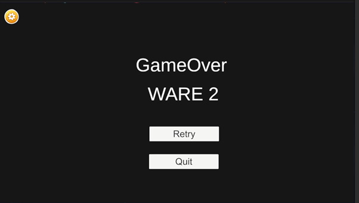

# Chicken Shooter

## Giới thiệu
**Chicken Shooter** là một trò chơi bắn súng không gian nơi người chơi điều khiển phi thuyền để tiêu diệt càng nhiều gà càng tốt và tránh các đòn tấn công từ enemy (kẻ địch) và boss. Game được phát triển bởi **Nguyễn Anh Tuấn** - Khóa K24GD03.

## Thông tin học viên
- **Học viên:** Nguyễn Anh Tuấn
- **Khóa:** K24GD03

## Thể loại
- Bắn súng không gian (Space Shooter)

---

## Cách chơi

### Điều khiển
- **Di chuyển:** Sử dụng các phím mũi tên hoặc WASD để di chuyển phi thuyền trong phạm vi màn hình.
- **Bắn:** Phi thuyền sẽ tự động bắn đạn theo chu kỳ.
- **PowerUp:** Ăn vật phẩm PowerUp để bắn đôi.
- **MultiUp:** Ăn vật phẩm MultiUp để bắn 5 tia cùng lúc.

### Tránh né
- **Enemy:** Kẻ địch sẽ thả trứng rơi xuống. Nếu va chạm với Player → Game Over.
- **Boss:** Có 2 kiểu tấn công:
  - **FanAttack:** Bắn nhiều đạn theo vòng quạt.
  - **DirectAttack:** Bắn thẳng vào vị trí của Player.
- **Lưu ý:** Người chơi cần di chuyển linh hoạt để tránh đạn.

---

## Tiến trình (Wave)
- Game được chia thành nhiều wave.
- Sau mỗi wave, EnemySpawner sẽ tạo đợt enemy mới.
- Cứ 3 wave sẽ xuất hiện Boss.
- Khi Boss chết, tiếp tục sang wave mới.

## Kết thúc trò chơi
- Nếu Player bị trứng hoặc đạn enemy trúng → Game Over.
- Hiển thị wave đã đạt được.
- Người chơi có thể chọn **Retry** để chơi lại hoặc **Quit** để thoát game.

---

## Cài đặt & chạy game

1. **Clone project:**
   ```bash
   git clone https://github.com/ngtuanz/final-lab.git
   cd final-lab
   ```
2. **Cài đặt các phụ thuộc:**  
   (Thêm hướng dẫn cài đặt nếu có sử dụng framework hoặc thư viện)
3. **Chạy game:**  
   (Thêm hướng dẫn chạy game, ví dụ: `python main.py` hoặc mở file thực thi)

   
**MENU**


**MAIN**


**OPTION**


**LOSE**




**BOSS**


